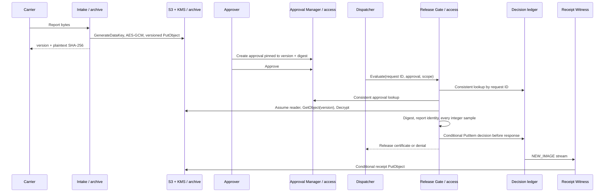
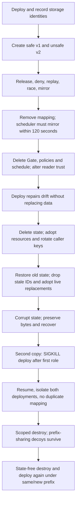

# FrostPass: benchmark author notes

## Introduction

Refrigerated freight operators need to connect a quality review to the exact
sensor data reviewed. Replacing the latest report, approving a good average
while an individual sample was unsafe, or losing a release decision during a
retry are realistic failure modes. FrostPass provides four immutable services
and asks the solver to build the infrastructure that keeps those boundaries.

The task preserves SealRoom's directory organization, offline toolchain,
two-account endpoint, separate runner, policy evaluation helpers and lifecycle
testing approach. It introduces a distinct release workflow: approval of an
unsafe report is insufficient, dispatcher receives a certificate rather than
file contents, every sample is validated, and a request ID binds one durable
decision. It also replaces the non-atomic receipt copy with a conditional write.

The difficulty is compositional. A basic Lambda deployment can pass a happy
path yet fail caller isolation, encryption context, attribute restrictions,
replay races, state adoption or teardown. Clear contracts make failure
diagnosable and fair. No finite benchmark can guarantee that every model fails;
hardness should ultimately be measured by model trials, not ambiguous rules.

## Infrastructure Used

| Component | Account | Purpose and boundary |
| --- | --- | --- |
| Intake Lambda + role | Archive | Write encrypted report versions; never read telemetry |
| Versioned private S3 report bucket | Archive | Preserve reviewed v1 even after unsafe v2 arrives |
| KMS key + stable alias | Archive | Envelope keys bound to exactly shipment/sensor context; alias assists recovery |
| Reader IAM role / STS | Archive | Only Gate assumes it; reads only reports and decrypts only the permitted key |
| Approval Manager Lambda + role | Access | Owns approval transitions; column-scoped creation |
| Approval DynamoDB table | Access | Consistent state and version/digest/expiry binding |
| Gate Lambda + role | Access | Checks current approval and full report; conditional first-writer decision |
| Decision DynamoDB table + stream | Access | Immutable request fingerprint and exact response; no release without persistence |
| Witness Lambda + role | Access | Copies ledger rows to archive; has no report or KMS access |
| Private versioned receipt S3 bucket | Archive | Inspectable durable receipt; conditional writes prevent replay/race versions |
| Stream mapping | Access | Low-latency receipt delivery; exactly one after recovery |
| Scheduler group, schedule and role | Access | Repairs missed receipts while mapping is absent; source-group trust limits deputy scope |
| Caller IAM users and keys | Both | Three single-function callers and a powerless outsider |

The application does not create infrastructure. Roles keep authority separate;
identity policies alone cannot protect data against other same-account
principals, so report read-denies and a non-delegating KMS key policy matter.
The emulator cannot enforce every AWS policy rule, so live behavior and an
independent policy evaluator are combined. Unsupported conditions never become
an accidental pass.

## Operational Flows

### Retries and collisions

Canonical JSON gives an order-independent request fingerprint. The first
conditional writer wins. Matching retries read the saved response; conflicting
payloads under the same ID deny without altering that response. A denial is
equally immutable: approval later requires a fresh evaluation ID. Revocation
affects fresh IDs, while replay is a historical receipt. The contract makes
this distinction explicit so no test silently expects contradictory behavior.

Concurrent tests send eight identical requests and eight alternating conflicting
ones through real Lambda invocations. They verify the winning fingerprint and
saved response. Receipt reconciliation races four workers through the missing
object path and checks exactly one remaining S3 version. Head-then-put without
a conditional request is inadequate for this last case.

The underlying atomic operations follow AWS's documented
[conditional DynamoDB PutItem](https://docs.aws.amazon.com/amazondynamodb/latest/APIReference/API_PutItem.html)
and [S3 conditional-write semantics](https://docs.aws.amazon.com/AmazonS3/latest/userguide/conditional-writes.html).

### Faults and recovery

Reference recovery discovers exact resource names and relationships rather than
deleting everything that starts with the prefix. Stable storage is imported;
stream mappings are filtered locally because endpoint filters are unreliable.
Unreadable state is moved aside. A restored state's old access-key IDs are
discarded when they differ from the live manifest, allowing new keys to be
created. The manifest is mode 0600, written and fsynced, atomically replaced,
then its directory fsynced before old keys are retired. Partial rotations after
a crash retain the published key and clean only unreferenced keys.

A crash can leave only a subset of the four access-key addresses in state.
Recovery removes only recorded addresses; attempting to remove all four makes
Terraform fail on missing entries. A focused regression covers empty, partial
and complete key states, and repeated real SIGKILL trials validate recovery.

The verifier watches old-key availability during rotation, checks caller user
identities, stream mapping count, creation timestamps, report versions and
receipt version counts, then reruns an old approved report. Mere exit-code
success or a plausible manifest cannot satisfy recovery.

### Good adversarial cases

- Safe 2000 and 8000 milli-Celsius endpoints; unsafe 1999 and 8001.
- First, middle and 64th-sample excursions to defeat averages/latest-only checks.
- Boolean, float, null, string, empty, oversized, wrong-header and non-UTF-8 reports.
- Reviewed digest differing from actual bytes; nonexistent pinned version.
- Safe v1 followed by unsafe v2, so latest-object reads fail observably.
- Pending/expired/revoked/out-of-scope approvals, with distinct request IDs.
- Identical replay, key-order replay, four field collisions and two concurrent fingerprints.
- A deny on decision PutItem while report retrieval still works: no certificate.
- Same-account S3-read probe and an STS-enabled wrong reader.
- Context absent, missing one key, extra key, and unauthorized KMS operations.
- Scheduler from the wrong group, wrong account, or absent source context.
- Mapping removal, drift, three state failures, crash, two deployments and prefix-sharing decoys.

## Score

The 35 groups sum to 100. Core release behavior, replay/concurrency and recovery
carry more weight than structural checks. Every point is all-or-nothing within
its group. A failed group records its error and later groups still run.
Release failure caps at 40, caller/direct-storage failures at 50, and failed
persist-before-release at 50. Only 100 is a full pass.

| Check | Points |
| --- | ---: |
| contract and declared state | 1 |
| four service topology | 1 |
| storage and bucket policy | 1 |
| two retained report versions | 2 |
| encrypted telemetry and reader trust | 3 |
| pending, expired and mismatched grants | 3 |
| approved version release | 4 |
| temperature boundaries and every sample | 4 |
| malformed and identity-mismatched telemetry | 3 |
| reviewed digest and missing version | 3 |
| stable replay and request collision | 4 |
| concurrent duplicate and conflicting requests | 4 |
| historical replay versus current revocation | 3 |
| exact archive receipt contents | 2 |
| concurrent receipt reconciliation | 2 |
| caller isolation | 2 |
| direct storage denial | 2 |
| least-privilege policies | 3 |
| attribute-level table writes | 3 |
| ledger failure closes release | 4 |
| revocation and audit | 2 |
| mirrored decisions | 1 |
| immutable reports and receipts | 3 |
| KMS key use and exact encryption context | 4 |
| scheduled reconciliation without stream | 3 |
| scheduler confused-deputy protection | 3 |
| stable redeploy | 2 |
| repair of deleted and altered resources | 3 |
| recovery after state loss | 6 |
| recovery from restored stale state | 4 |
| recovery from corrupted state | 3 |
| isolated crash-consistent second deployment | 4 |
| complete and scoped destroy | 3 |
| destroy after state loss | 3 |
| secret handling | 2 |
| **Total** | **100** |

## Verification integrity and scope

Submission executes as the agent user in a separate runner with no verifier
code or Docker socket. Verifier controls are on a dedicated internal network.
Both environments use independently built fixed images and public contracts;
application and contract copies are checked for byte equality by the author
quality tool. Terraform labels are not inspected for correctness. Manifest
identifiers are checked against AWS APIs and state identifiers.

The task is a local AWS-shaped infrastructure benchmark. It is not a production
cold-chain certification system: the temperature rule is synthetic and the
certificate is an evaluation receipt, not physical shipment authorization.
The app's algorithms are supplied rather than assigned to the solver. Their
unit-level correctness and verifier rejection cases complement full reference
end-to-end runs; actual model failure rates require separate model trials.
