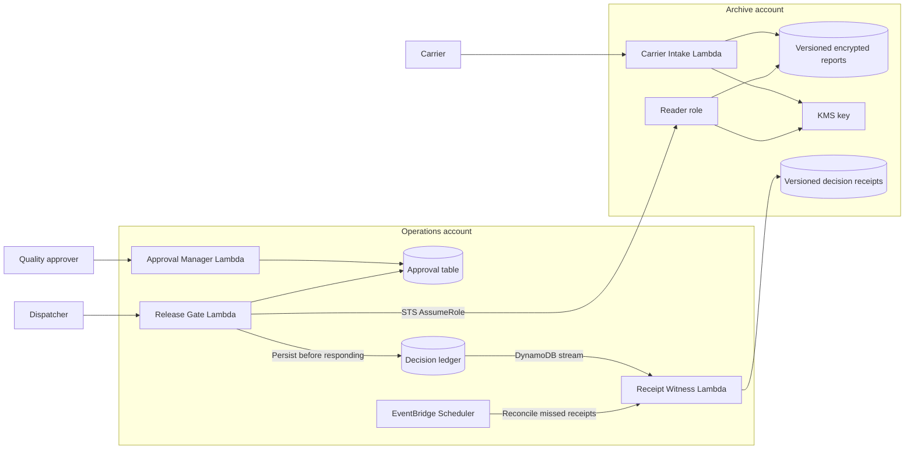

# FrostPass

### A security and recovery benchmark for LLM agents


**Can an AI agent deploy a secure system that preserves its decisions through retries, concurrent requests, broken infrastructure, and lost state?**

FrostPass tests this through a refrigerated freight release workflow. A carrier uploads an encrypted sensor report, an approver reviews a specific version, and a dispatcher requests a release certificate. The system must reject unsafe or malformed telemetry, preserve the first recorded decision, and recover without losing the evidence behind it.

Agents provision and connect four supplied application services using Terraform or OpenTofu. The evaluator checks observable behavior, permissions, persistence, and deployment recovery across two locally emulated AWS accounts.

[Task instructions](instruction.md) · [Runtime contract](environment/workspace/contracts/runtime.md) · [Reference solution](solution/) · [Validation results](tools/validation/VALIDATION.md) · [Design rationale](reasoning.md)

## At a glance

| Capability | What FrostPass exercises |
| --- | --- |
| LLM agent evaluation | 35 scored capability groups, weighted scoring, and gates for critical failures. |
| Cloud security | Cross-account role assumption, narrow IAM permissions, KMS encryption context, and private versioned storage. |
| Distributed systems | Conditional writes, concurrent request conflicts, durable idempotency, and receipt reconciliation. |
| Infrastructure recovery | Deleted resources, lost or stale state, corrupted state, and an interrupted deployment. |
| Evaluation quality | Separate submission execution, live API checks, policy analysis, and deliberately faulty application variants. |

## Architecture



| Service | Responsibility |
| --- | --- |
| **Carrier Intake** | Encrypt report bytes with AES-GCM and store a distinct S3 object version. |
| **Approval Manager** | Create, approve, and revoke approvals bound to a shipment, sensor, report version, and SHA-256 digest. |
| **Release Gate** | Validate the approval, retrieve the pinned report, check every sample, and durably record a release or denial. |
| **Receipt Witness** | Mirror decisions to the archive without overwriting existing receipts; reconcile missed stream deliveries on a schedule. |

The four application images are fixed. The agent's task is to provision the infrastructure and implement its lifecycle automation.

## Behavior that makes the benchmark challenging

### Exact evidence, exact decision

An approval applies to one report version and digest. Uploading a newer report must not change what an existing approval means. Every temperature sample must satisfy the benchmark's inclusive **2–8 °C** range; an acceptable average cannot hide an unsafe sample.

The Gate returns a release certificate or a denial. Raw sensor report bytes stay private.

### Durable decisions under concurrency

One request ID identifies one immutable evaluation:

- Identical retries return the original stored response.
- Different payloads using the same request ID are rejected as conflicts.
- Concurrent requests converge on one winning request fingerprint.
- A certificate can be returned only after its decision is persisted.
- Historical replay preserves the recorded response; a new request checks the current approval and revocation state.

Receipt writes are also conditional. Stream retries and scheduled reconciliation must leave exactly one receipt version for each decision.

### Recovery with surviving data intact

The evaluator deletes or alters resources, removes local state, restores stale state, corrupts state, and interrupts a second deployment. Automation must rediscover and adopt surviving resources, preserve stored reports and decisions, rotate caller credentials safely, and leave unrelated deployments untouched.

Teardown is tested both with and without local state, including unrelated resources that share the deployment's name prefix.

## Evaluation and scoring

The [verifier](tests/verify.py) combines workload checks with [infrastructure checks](tests/infrastructure_checks.py). Submission scripts execute in a separate runner without the verifier source or Docker socket. Security evaluation combines live API behavior with policy analysis because the emulator does not enforce every AWS rule.

**35 capability groups sum to 100 points.** Each group awards all or none of its points, and a full pass requires 100/100.

| Evaluation area | Representative checks |
| --- | --- |
| Release correctness | Version pinning, digest verification, temperature boundaries, malformed telemetry, and approval scope. |
| Persistence and concurrency | Stable replay, request collisions, concurrent decisions, immutable receipts, and failure to persist a decision. |
| Security boundaries | Caller isolation, direct storage denial, attribute-level table writes, exact KMS context, and Scheduler trust. |
| Availability and lifecycle | Scheduled reconciliation, drift repair, state recovery, interrupted deployment, and scoped cleanup. |

Critical failures limit the final score:

| Failed capability | Score ceiling |
| --- | ---: |
| Approved version release | 40/100 |
| Caller isolation or direct storage denial | 50/100 |
| Closing release when ledger persistence fails | 50/100 |

Detailed results are written to `/logs/verifier/report.json`, with machine-readable rewards in `reward.json` and `reward.txt`. Check for `invalid.json` and deployment/harness errors before attributing a low score to an agent.

## Recorded validation

The repository includes an author validation record dated **6 October 2026** and its [reference report](tools/validation/reference-report.json).

| Check | Recorded result |
| --- | --- |
| Clean reference evaluation | **35/35 groups; 100/100 points** |
| Recovery after state loss | **14.5 seconds** against a 90-second objective |
| Recovery from restored stale state | **25.9 seconds** against a 90-second objective |
| Recovery from corrupted state | **14.4 seconds**, preserving the damaged bytes |
| Three additional interrupted-deployment trials | All recovered, released, and cleaned up |
| Offline quality checks | **16 passed** |
| Deliberately faulty application variants | **All five rejected** |

The five faulty variants use average-only temperature checks, inspect only the final sample, omit the reviewed digest, overwrite the decision ledger unconditionally, or allow release after a failed ledger write.

These results validate the reference implementation and test coverage. They do not measure LLM success rates. See the [validation notes](tools/validation/VALIDATION.md) for scope and the [design rationale](reasoning.md) for the full scoring breakdown.

## Repository layout

```text
FrostPass/
├── README.md
├── instruction.md                  # Agent-facing task
├── reasoning.md                    # Detailed design and scoring rationale
├── environment/
│   ├── application/                # Four supplied Lambda image sources
│   ├── workspace/contracts/        # Runtime contract and manifest schema
│   ├── Dockerfile
│   └── docker-compose.yaml
├── solution/                       # Reference Terraform and lifecycle scripts
├── tests/
│   ├── verify.py                   # Workload checks and scoring
│   ├── infrastructure_checks.py    # Policy, state, recovery, and cleanup checks
│   ├── runtime/runner.py           # Separate submission execution service
│   └── docker-compose.yaml
└── tools/
    ├── check_project.py            # Offline checks and mutation cases
    ├── smoke.py                    # Probe an existing deployment
    ├── crash_probe.py              # Additional interrupted-deployment checks
    └── validation/                 # Recorded results and source fingerprints
```

## Getting started

### 1. Run the offline quality checks

Requires **Python 3.11 or newer**. These checks use standard-library SDK shims and a conditional-write fake; no AWS account, Docker engine, or model access is needed.

```bash
git clone https://github.com/Shulinagarwal/FrostPass.git
cd FrostPass
python tools/check_project.py
```

### 2. Run the reference evaluation

Requires a **Linux Docker engine**, Docker Compose v2, access to the Docker socket, and network access for image and dependency downloads. On Windows, use Docker Desktop with Linux containers and run these commands from WSL.

The stack runs against the pinned Floci AWS emulator and bootstraps local credentials. No production AWS credentials are required. This workflow evaluates the supplied reference solution without launching an LLM.

```bash
# Start the verifier, submission runner, and emulated AWS services.
docker compose -p frostpass-demo -f tests/docker-compose.yaml up -d --build --wait main

# Provide the reference implementation as the submission.
docker compose -p frostpass-demo -f tests/docker-compose.yaml cp solution/. main:/workspace/submission/

# Evaluate and inspect the detailed report.
docker compose -p frostpass-demo -f tests/docker-compose.yaml exec -T main bash /tests/test.sh
docker compose -p frostpass-demo -f tests/docker-compose.yaml exec -T main cat /logs/verifier/report.json
```

Save results before removing the stack:

```bash
docker compose -p frostpass-demo -f tests/docker-compose.yaml cp main:/logs/verifier/ ./evaluation-results/
docker compose -p frostpass-demo -f tests/docker-compose.yaml down --volumes --remove-orphans
```

Use a fresh Compose project or remove its previous volumes before another independent evaluation. The verifier deliberately changes and destroys resources within the local account.

### Submission interface

Agents work under `/workspace/submission/` and provide `deploy.sh`, `destroy.sh`, and Terraform/OpenTofu configuration under `infra/`. A successful deployment atomically publishes a mode-0600 `manifest.json` matching the [manifest schema](environment/workspace/contracts/manifest.schema.json).

`FROSTPASS_PREFIX` selects the deployment. Normal deployment has a 720-second budget, recovery from lost, stale, or corrupted state has 90 seconds, and teardown has 900 seconds. The [runtime contract](environment/workspace/contracts/runtime.md) defines the complete behavior and permissions.

## Scope

FrostPass demonstrates LLM agent evaluation, cloud security, distributed decision recording, and infrastructure recovery. Its temperature range is a synthetic benchmark rule, and its certificates are evaluation outputs. The local AWS environment supports repeatable testing; production deployment and real freight authorization require separate validation.

---

Created by [Shulin Agarwal](https://github.com/Shulinagarwal).
